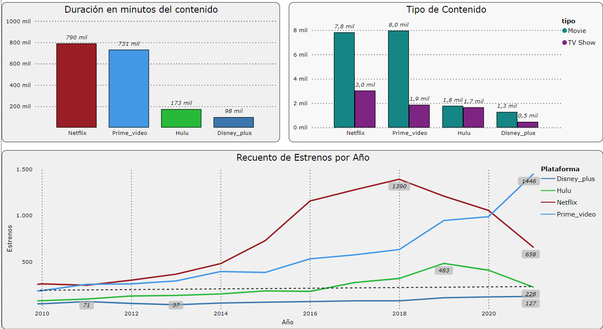

# Streaming-Platform

## 1 - Descripción
Este estudio se ha llevado a cabo para examinar el crecimiento y la expansión del contenido en las plataformas de streaming a lo largo del tiempo, transformando nuestra percepción de la televisión tradicional hacia un consumo de contenido bajo demanda, en cualquier momento y lugar.

Para lograr este objetivo, se siguieron los siguientes pasos.

## 2 - Objetivos de desarrollo
### 2.1 - Analisis exploratorio
El principal objetivo es investigar las variables a partir de los datos obtenidos de varios DataSets.
### 2.2 Limpieza de datos
Se inició eliminando valores NaN, identificando errores en las tablas e implementando mejoras para optimizarlas. Una vez que los datos estuvieron limpios, se estandarizaron los tipos de datos para garantizar homogeneidad. Luego, se concatenaron todos los conjuntos de datos en uno solo para trabajar con un archivo .csv.

### 2.4 Grafica

## 3 - Estudio
Como se puede observar, el crecimiento de las plataformas de streaming a lo largo de la última década ha sido significativo. Sin embargo, se nota una disminución notable en el contenido de la plataforma Netflix, probablemente debido a un aumento en su tarifa de suscripción asociada con una baja en la calidad del contenido.

Es destacable el rápido crecimiento de Prime Video en los últimos años, superando en contenido a Netflix. Esto se atribuye a la adquisición de derechos de series televisivas muy populares en España y a la creación de sus propias exclusivas.

Además, se observa que la oferta de películas es considerablemente mayor que la de series en estas plataformas.
Por último, la duración en minutos de todo el contenido por plataforma proporciona una idea de la cantidad de tiempo que podemos invertir en ellas.

## 4 - Dashboard PowerBI
Una vez realizado el estudio lo he trasladado todo a un dashboard en PowerBI para darle mas claridad, calidad e iteraticvidad, si quereis obtenerlo para visualizarlo o trabajarlo os dejo aqui el enlace
| Dashboard | [Plataforma_Streaming.pbix][PlDb] |
